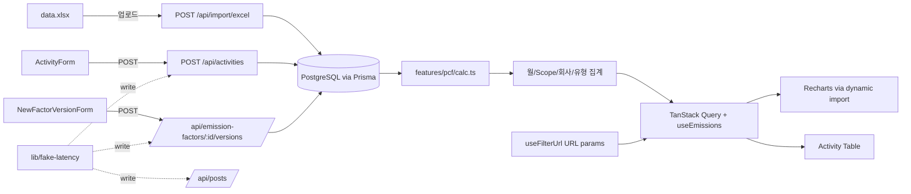

# Architecture

## 1. 데이터 흐름



## 2. ERD

```mermaid
erDiagram
  COUNTRY ||--o{ COMPANY : has
  COMPANY ||--o{ ACTIVITY : records
  COMPANY ||--o{ POST : tagged
  ACTIVITY_TYPE ||--o{ ACTIVITY : classifies
  ACTIVITY_TYPE ||--o{ EMISSION_FACTOR : measured_by
  EMISSION_FACTOR ||--o{ FACTOR_VERSION : versioned

  COUNTRY { string code PK string name }
  COMPANY { string id PK string name string countryCode FK }
  ACTIVITY_TYPE { string key PK string label enum scope string category string defaultUnit }
  ACTIVITY { string id PK string companyId FK string typeKey FK date date float amount string unit }
  EMISSION_FACTOR { string id PK string typeKey FK unique string description string numerator string denominator string source }
  FACTOR_VERSION { string id PK string factorId FK int version float value date validFrom date validTo string note }
  POST { string id PK string title string resourceUid FK string dateTime string content }
```

## 3. 상태 경계 (Rendering 효율 노트)

| 종류 | 어디에 사는가 | 누가 갱신 | 무엇을 트리거 |
| --- | --- | --- | --- |
| **Layout state** (drawer open) | `AppShell` 컴포넌트 useState | 사용자 메뉴 토글 | Drawer만 리렌더 |
| **Filter state** | **URL search params** (single source) | `FilterBar` setFilter | URL 변경 → 해당 페이지의 query key 무효화 → 데이터 fetch |
| **Server data state** | TanStack Query 캐시 (`queryKey: ['activities', filter]` 등) | mutation onSettled 시 invalidate | 데이터 쓰는 컴포넌트만 |
| **Form state** | `react-hook-form` 인스턴스 | 입력 이벤트 | 폼 내부 컨트롤만 |
| **Mutation state** | `useMutation` (pending/error/success) | mutate 호출 | 해당 버튼·토스트만 |

핵심:
- 차트는 `useEmissions`가 반환하는 **메모이즈된 집계 결과**만 받기 때문에, 폼 입력으로 인한 form state 변경은 차트 리렌더를 트리거하지 않는다.
- Recharts 컴포넌트는 `React.memo` + `dynamic(ssr:false)` 로 초기 번들에서 분리.
- `aggregateByMonth/Scope/Company/Type`는 `useEmissions` 내부에서 4개 query data 의존성으로 `useMemo` 됨 → 동일 필터 조합에서 재계산 없음.
- 활동 입력 시 **낙관적 업데이트** 로 즉시 목록에 반영, 실패 시 snapshot 복원.

## 4. Fake API 시뮬레이션

`lib/fake-latency.ts` 의 `withFakeLatency()` 는 모든 **write** API에서 사용:
- 200~800ms 임의 지연 (`SIMULATE_LATENCY=1` 일 때).
- `mayFail: true` 옵션 — 15% 확률로 `SimulatedFailureError` throw → API 응답 503.
- 클라이언트 mutation 훅이 onError 에서 snapshot 복원 + 사용자에게 토스트 표시.

테스트/평가 시에는 환경변수로 끄거나 비율을 조정할 수 있다.

## 5. 폴더 별 책임

```
app/                Next.js App Router 페이지 + Route Handlers
components/         Stateless UI building blocks + 일부 form
features/pcf/       PCF 도메인 모델 + 계산 + 서버 데이터 훅 + 가공
features/filters/   URL 동기화 필터 훅 (모든 페이지 공유)
lib/                도메인 외 인프라(prisma, units, validation, fetch, 시뮬레이션, 파서)
prisma/             스키마 + 마이그레이션 + seed
tests/              setup.ts (jest-dom) + *.test.{ts,tsx} 산재
```

## 6. 의존성 선택 근거

- **Recharts**: 빠른 구현 · React 친화적 · 무거운 D3 직접 사용 없이 적당한 인터랙션.
- **TanStack Query**: write 후 invalidate + 낙관적 업데이트의 표준 패턴. 영문 과제의 loading/error/partial-failure UX와 잘 맞는다.
- **react-hook-form + Zod**: 폼 + 서버 양쪽에서 동일한 스키마를 공유 → 단일 진실 공급원(SSOT).
- **Prisma**: 마이그레이션 자동화 + Postgres 트랜잭션 API의 자연스러움 + 강력한 타입 추론.
- **shadcn 패턴(직접 구현)**: 헤드리스 atoms 만 제공해 무거운 라이브러리 금지 요건 충족 + 디자인 토큰 자유도.
